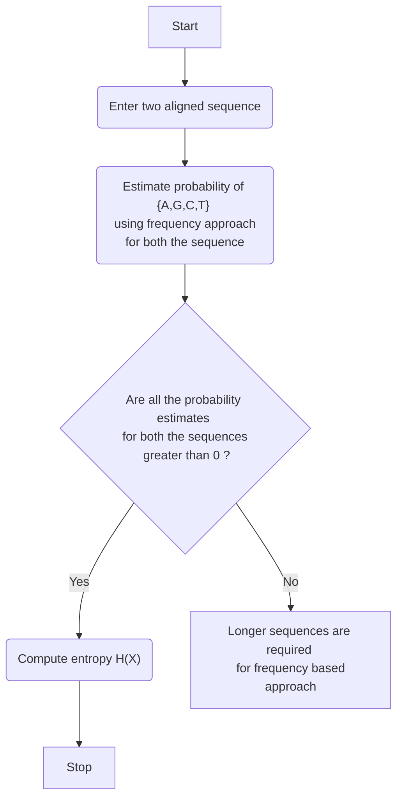
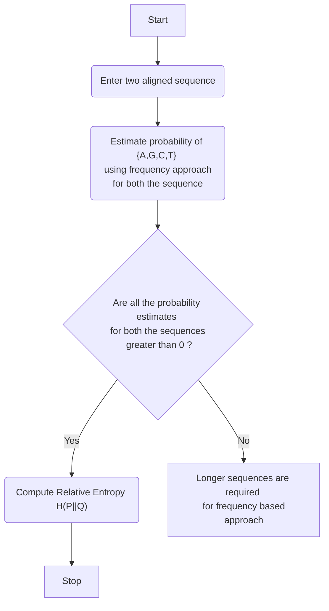
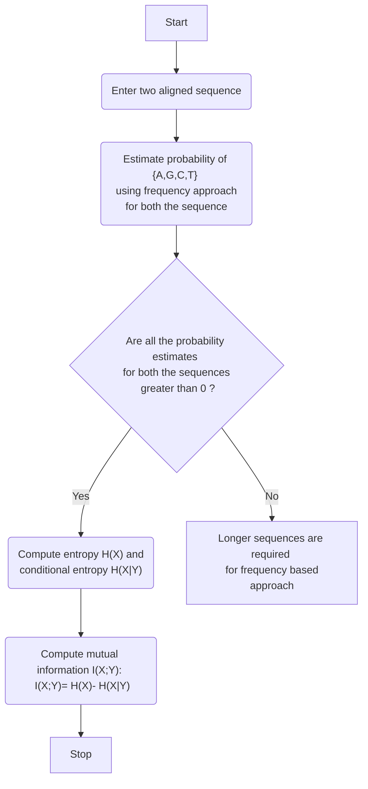

# ST-019 Bio-Computing Assignment 1
## Saurav Jadhav (2120) and Abhijit Chavan (2108)
<br>


### We know that entropy is given by:

$$ H(X)= -\sum_{i=1}^n p_i  \log_2{p_i} $$

### The Relative Entropy is given by:

$$ H(P||Q)= \sum_{i=1}^n p(x_i) \log_2{p(x_i)/ q(x_i)} $$

### The Mutual Information is given by: 
$$ I(X;Y)= H(X)- H(X|Y) $$

 
## Algorithm, Code, and Flow Chart for Entropy, Cross Entropy, and Mutual Information  


## Algorithm for Entropy 
___________________________________________________________________________________________________________________________________________________________________________

Algorithm: Entropy

1. Consider two aligned sequences
2. Estimate probability of {A,G,C,T} using frequency approach for both the sequence
3. If all the probability estimates for both the sequences are greater than 0 then go to step 4 otherwise go to step 5 
4. Compute entropy H(X) and go to step 6 
5. Longer sequences are required for frequency based approach; stop.
6. Stop.
___________________________________________________________________________________________________________________________________________________________________________
## Flow chart for Entropy

## Code for entropy

Before we write the code for entropy, we first have to come up with a function for probability estimation.
We also design a function to generate sequences 
```
# For the purpose of generating data, first we design a function called as genseq:

genseq= function(n,p)
{
  s=sample(x = c("A","G","C","T"),size=n,replace = T,prob = p)
  return(s)
}


#p_hat is a function for probability assignment to each value in the sequence
p_hat=function(rv)
{
  f=c()
  n=length(rv)
  un=length(unique(rv))
  for( i in 1:un)
    f[i]= table(rv)[[i]]
return(f/n)
}
 # Code for Entropy
 
 entr= function(rv) # function for entropy
{
  n= length(rv)
  val=unique(rv)
  prob=p_hat(rv)
  entropy=0
  for( i in 1:length(val))
  entropy= entropy + -prob[i]* log(prob[i],base=2)
return(entropy)  
}

# calculation on one example
l=genseq(100,p=c(0.25,0.25,0.25,0.25))
entr(l)
```
## Algorithm for Relative Entropy

___________________________________________________________________________________________________________________________________________________________________________

Algorithm: Relative Entropy

1. Consider two aligned sequences
2. Estimate probability of {A,G,C,T} using frequency approach for both the sequence
3. If all the probability estimates for both the sequences are greater than 0 then go to step 4 otherwise go to step 5 
4. Compute entropy H(P||Q) and go to step 6 
5. Longer sequences are required for frequency based approach; stop.
6. Stop. 
___________________________________________________________________________________________________________________________________________________________________________

## Flow Chart for Relative Entropy

## Code for relative entropy
```
relat_entr= function(rv1,rv2) # function for relative entropy
{
  n= length(rv1)
  val1=unique(rv1)
  prob1=p_hat(rv1)
  prob2=p_hat(rv2)
  entropy=0
  for( i in 1:length(val1))
    entropy= entropy + prob1[i]* log(prob1[i]/prob2[i],base=2)
  return(entropy)  
}
s1= genseq(100,p=c(0.25,0.25,0.25,0.25))
s2= genseq(100,p = c(0.1,0.2,0.3,0.4))
relat_entr(s1,s2)
```
## Algorithm for Mutual Information 
___________________________________________________________________________________________________________________________________________________________________________

Algorithm: Mutual Information

1. Consider two aligned sequences
2. Estimate probability of {A,G,C,T} using frequency approach for both the sequence
3. If all the probability estimates for both the sequences are greater than 0 then go to step 4 otherwise go to step 5 
4. Compute entropy H(X) and conditional entropy H(X|Y) and go to step 6 
5. Longer sequences are required for frequency based approach; stop.
6. Compute mutual information I(X;Y): <br> I(X;Y)= H(X)- H(X|Y)
7. Stop. 
___________________________________________________________________________________________________________________________________________________________________________
## Flow Chart for Mutual Information 

## Code for Mutual Information
```
p1=c(0.2,0.3,0.3,0.2)
p2=c(0.1,0.4,0.2,0.3)
mutual_info= function(s1,s2)
{
  
  if(length(s1)==length(s2))
  {
    s=0
    n=length(s1)
    s_unique= unique(s1)
    p_matrix= matrix(nrow = 4,ncol = 4)
    for(i in 1:length(s_unique))
    {
      for( j in 1:length(s_unique))
      {
       p_matrix[i,j]=length(which(s1==s_unique[i]& s2==s_unique[j]))/n
      }
    }
    
    ps1=apply(p_matrix,1,sum)
    ps2= apply(p_matrix,2,sum)
    for(i in 1:length(s_unique))
    {
      for( j in 1:length(s_unique))
      {
        if(p_matrix[i,j]==0)
        s= s 
        else
        s=s+p_matrix[i,j]*log(p_matrix[i,j]/(ps1[i]*ps2[j]),base = 2)
  
      }
      
    }
    return(s)
  }
  else
    paste("Both the sequence should be of equal length")

    }


s1= genseq(10000,p1)
s2= genseq(10000,p2)
mutual_info(s1,s2)
```


